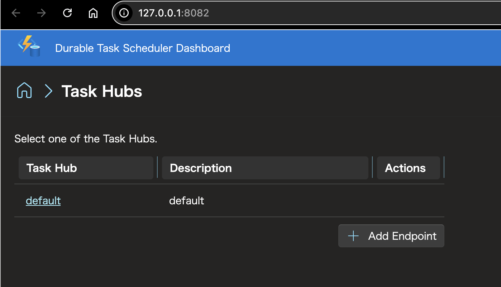

# GitHub CodespacesでDurable Task Schedulerエミュレーターを起動してFanOutFanInを試す

## はじめに

## GitHub CodespacesでSpaceを起動する

まずは完成系の状態を見てみましょう。

## 順番に起動してみる

完成系を見たところで、どのような順番で起動するのかを確認してきたいと思います。
今回は.NETを使った方法を紹介します。

順番としては以下のとおりです。

- Durable Task Scheduler エミュレーターをpull
- docker runでDurable Task Scheduler エミュレーターを起動
- ダッシュボードにアクセスする
- Durable-Task-Schedulerのリポジトリをクローンする
- ワーカーをビルドして起動
- クライアントをビルドして起動

## Durable Task Scheduler エミュレーターをpullする

以下のコマンドを実行して、Durable Task Scheduler エミュレーターのDockerイメージをpullします。

```bash
docker pull mcr.microsoft.com/dts/dts-emulator:latest
```

実行結果（一部抜粋）

```txt
Digest: sha256:ef0b75cab52358409dadc34b675d659e397729c0b68f4ea51b9afa5136072dfb
Status: Downloaded newer image for mcr.microsoft.com/dts/dts-emulator:latest
```

## Durable Task Scheduler エミュレーターを起動する

以下のコマンドを実行して、Durable Task Scheduler エミュレーターを起動します。

```bash
docker run --name dtsemulator -d -p 8080:8080 -p 8082:8082 mcr.microsoft.com/dts/dts-emulator:latest
```

実行結果（一部抜粋）

```txt
dbbf44836d36494ee4aafd9a7d9104eef008375881866053886c7f38ce9706a5
```

実行すると、上記のようなコンテナIDが表示されます。

## ダッシュボードにアクセスする

GitHub Codespacesをブラウザ起動している場合は8082のポートにアクセスすることで、Durable Task Scheduler エミュレーターのダッシュボードにアクセスできます。


※VSCodeから起動している場合は[http://127.0.0.1:8082/](http://127.0.0.1:8082/)にアクセスすることで、Durable Task Scheduler エミュレーターのダッシュボードにアクセスできます。



## ワーカーをビルドして起動する

## クライアントをビルドして起動する

## まとめ

## Azure Developer CLIのセットアップ

以下のコマンドを実行して、Azure Developer CLI (azd) をインストールします。

```bash
curl -fsSL https://aka.ms/install-azd.sh | bash
```

インストール方法は[公式ドキュメント](https://learn.microsoft.com/ja-jp/azure/developer/azure-developer-cli/install-azd)を参照してください。

### Azure Developer CLIの動作確認

以下のコマンドでAzure Developer CLIのバージョンを確認します。

```bash
azd version
```

### Azure Developer CLIでログインする

環境変数 `AZURE_TENANT_ID`が設定されている場合は、以下のコマンドでログインします。

```bash
azd auth login --tenant-id $AZURE_TENANT_ID
```

環境変数が設定されていない場合は、以下のコマンドでログインします。

```bash
azd auth login
```

## Azure CLIをセットアップする

以下のコマンドを実行して、Azure CLIをインストールします。

```bash
curl -sL https://aka.ms/InstallAzureCLIDeb | sudo bash
```

インストール方法は[公式ドキュメント](https://learn.microsoft.com/ja-jp/cli/azure/install-azure-cli-linux?pivots=apt)を参照してください。

## Azure CLIでログインする

環境変数 `AZURE_TENANT_ID`が設定されている場合は、以下のコマンドでログインします。

```bash
az login --tenant $AZURE_TENANT_ID
```

### Azure CLIの動作確認

以下のコマンドでAzure CLIのバージョンとアカウント情報を確認します。

```bash
az version
az account list
```

ロケーション間違えると以下のようなエラーが出るので注意してください。

```
(LocationNotAvailableForResourceType) The provided location 'eastus' is not available for resource type 'Microsoft.DurableTask/schedulers'. List of available regions for the resource type is 'northcentralus,westus2,northeurope,uksouth,swedencentral,australiaeast,centralus,eastasia,koreacentral,eastus2,brazilsouth,canadacentral,centralindia,francecentral,germanywestcentral,italynorth,japaneast,japanwest,norwayeast,polandcentral,southafricanorth,southeastasia,switzerlandnorth,uaenorth,westus,westus3'.
Code: LocationNotAvailableForResourceType
Message: The provided location 'eastus' is not available for resource type 'Microsoft.DurableTask/schedulers'. List of available regions for the resource type is 'northcentralus,westus2,northeurope,uksouth,swedencentral,australiaeast,centralus,eastasia,koreacentral,eastus2,brazilsouth,canadacentral,centralindia,francecentral,germanywestcentral,italynorth,japaneast,japanwest,norwayeast,polandcentral,southafricanorth,southeastasia,switzerlandnorth,uaenorth,westus,westus3'.
```

## 参考

- [クイック スタート: Durable Task SDK と Durable Task Scheduler を使用してアプリを作成する](https://learn.microsoft.com/ja-jp/azure/azure-functions/durable/durable-task-scheduler/quickstart-portable-durable-task-sdks?tabs=windows&pivots=csharp)

## GitHub Codespacesの設定

`.env`でシークレットを管理する場合、以下のコマンドでCodespacesにシークレットを設定します。

```bash
gh secret set --app codespaces -f .env
```

シークレットの一覧を確認するには、以下のコマンドを実行します。

```bash
gh secret list --app codespaces
```

単一のシークレットを設定するには、以下のコマンドを使用します。

```bash
gh secret set --app codespaces SECRET_NAME
```

シークレットの削除は以下のコマンドで行います。

```bash
gh secret delete --app codespaces SECRET_NAME
```
